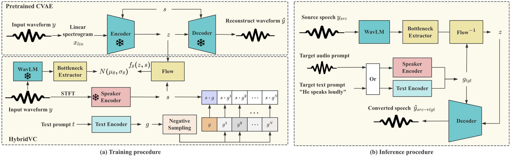
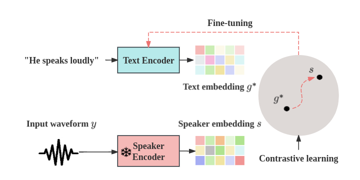

# 
 HybridVC: Efficient Voice Style Conversion with Text and Audio Prompts 

 Xinlei Niu1, Jing Zhang1, Charles Patrick Martin1 
 
 

 1 Australian National University, Canberra, Australia 

## Abstract
We introduce HybridVC, a voice conversion (VC) framework built upon a pre-trained conditional variational autoencoder (CVAE) that combines the strengths of a latent model with contrastive learning. HybridVC supports text and audio prompts, enabling more flexible voice style conversion. HybridVC models a latent distribution conditioned on speaker embeddings acquired by a pretrained speaker encoder and optimises style text embeddings to align with the speaker style information through contrastive learning in parallel. Therefore, HybridVC can be efficiently trained under limited computational resources. Our experiments demonstrate HybridVC's superior training efficiency and its capability for advanced multi-modal voice style conversion. This underscores its potential for widespread applications such as user-defined personalised voice in various social media platforms. A comprehensive ablation study further validates the effectiveness of our method.

## Architecture

Overall pipeline of HybridVC

Text embedding optimization

## The comprarison between generated samples by FreeVC [1], YoursTTS-VC [2], and HybridVC

This section contains demonstration in Table 1 of the paper which involves voice style conversion results given audio prompt only. HybridVC (PromptSpeech) represents the model was trained on the PromptSpeech dataset, and the HybridVC (VCTK) means the model was trained on the VCTK training set.

| 
Source speech
 | 
Audio prompt
 | 
FreeVC [1]
 |
YourTTS-VC [2]
|
HybridVC (PromptSpeech)
|
HybridVC (VCTK)
|
| :--- | :--- | :--- |:--- |:--- |
|<audio src="./Audio_prompt/src/p227_044.wav" controls preload></audio>|<audio src="./Audio_prompt/tgt/p316_002.wav" controls preload></audio>|<audio src="./Audio_prompt/freevc/p227_044.wav" controls preload></audio>|<audio src="./Audio_prompt/yourtts-vc/p227_044.wav" controls preload></audio>|<audio src="./Audio_prompt/hybridvc/p227_044.wav" controls preload></audio>|<audio src="./Audio_prompt/hybridvc-vctk/p227_044.wav" controls preload></audio>|
|<audio src="./Audio_prompt/src/p259_346.wav" controls preload></audio>|<audio src="./Audio_prompt/tgt/p288_338.wav" controls preload></audio>|<audio src="./Audio_prompt/freevc/p259_346.wav" controls preload></audio>|<audio src="./Audio_prompt/yourtts-vc/p259_346.wav" controls preload></audio>|<audio src="./Audio_prompt/hybridvc/p259_346.wav" controls preload></audio>|<audio src="./Audio_prompt/hybridvc-vctk/p259_346.wav" controls preload></audio>|
|<audio src="./Audio_prompt/src/p271_125.wav" controls preload></audio>|<audio src="./Audio_prompt/tgt/p263_248.wav" controls preload></audio>|<audio src="./Audio_prompt/freevc/p271_125.wav" controls preload></audio>|<audio src="./Audio_prompt/yourtts-vc/p271_125.wav" controls preload></audio>|<audio src="./Audio_prompt/hybridvc/p271_125.wav" controls preload></audio>|<audio src="./Audio_prompt/hybridvc-vctk/p271_125.wav" controls preload></audio>|
|<audio src="./Audio_prompt/src/p305_417.wav" controls preload></audio>|<audio src="./Audio_prompt/tgt/p253_219.wav" controls preload></audio>|<audio src="./Audio_prompt/freevc/p305_417.wav" controls preload></audio>|<audio src="./Audio_prompt/yourtts-vc/p305_417.wav" controls preload></audio>|<audio src="./Audio_prompt/hybridvc/p305_417.wav" controls preload></audio>|<audio src="./Audio_prompt/hybridvc-vctk/p305_417.wav" controls preload></audio>|
|<audio src="./Audio_prompt/src/p374_025.wav" controls preload></audio>|<audio src="./Audio_prompt/tgt/p288_338.wav" controls preload></audio>|<audio src="./Audio_prompt/freevc/p374_025.wav" controls preload></audio>|<audio src="./Audio_prompt/yourtts-vc/p374_025.wav" controls preload></audio>|<audio src="./Audio_prompt/hybridvc/p374_025.wav" controls preload></audio>|<audio src="./Audio_prompt/hybridvc-vctk/p374_025.wav" controls preload></audio>|
|<audio src="./Audio_prompt/src/p252_164.wav" controls preload></audio>|<audio src="./Audio_prompt/tgt/p295_078.wav" controls preload></audio>|<audio src="./Audio_prompt/freevc/p252_164.wav" controls preload></audio>|<audio src="./Audio_prompt/yourtts-vc/p252_164.wav" controls preload></audio>|<audio src="./Audio_prompt/hybridvc/p252_164.wav" controls preload></audio>|<audio src="./Audio_prompt/hybridvc-vctk/p252_164.wav" controls preload></audio>|
|<audio src="./Audio_prompt/src/p302_122.wav" controls preload></audio>|<audio src="./Audio_prompt/tgt/p279_381.wav" controls preload></audio>|<audio src="./Audio_prompt/freevc/p302_122.wav" controls preload></audio>|<audio src="./Audio_prompt/yourtts-vc/p302_122.wav" controls preload></audio>|<audio src="./Audio_prompt/hybridvc/p302_122.wav" controls preload></audio>|<audio src="./Audio_prompt/hybridvc-vctk/p302_122.wav" controls preload></audio>|
|<audio src="./Audio_prompt/src/p376_102.wav" controls preload></audio>|<audio src="./Audio_prompt/tgt/p304_419.wav" controls preload></audio>|<audio src="./Audio_prompt/freevc/p376_102.wav" controls preload></audio>|<audio src="./Audio_prompt/yourtts-vc/p376_102.wav" controls preload></audio>|<audio src="./Audio_prompt/hybridvc/p376_102.wav" controls preload></audio>|<audio src="./Audio_prompt/hybridvc-vctk/p376_102.wav" controls preload></audio>|
|<audio src="./Audio_prompt/src/p282_028.wav" controls preload></audio>|<audio src="./Audio_prompt/tgt/p263_248.wav" controls preload></audio>|<audio src="./Audio_prompt/freevc/p282_028.wav" controls preload></audio>|<audio src="./Audio_prompt/yourtts-vc/p282_028.wav" controls preload></audio>|<audio src="./Audio_prompt/hybridvc/p282_028.wav" controls preload></audio>|<audio src="./Audio_prompt/hybridvc-vctk/p282_028.wav" controls preload></audio>|
|<audio src="./Audio_prompt/src/p313_323.wav" controls preload></audio>|<audio src="./Audio_prompt/tgt/p308_172.wav" controls preload></audio>|<audio src="./Audio_prompt/freevc/p313_323.wav" controls preload></audio>|<audio src="./Audio_prompt/yourtts-vc/p313_323.wav" controls preload></audio>|<audio src="./Audio_prompt/hybridvc/p313_323.wav" controls preload></audio>|<audio src="./Audio_prompt/hybridvc-vctk/p313_323.wav" controls preload></audio>|

## Generated samples of HybridVC with style text prompts only

This section contains demonstration of voice style conversion results given style text prompts only.

| 
Text prompt
 | 
Source speech
 | 
HybridVC
 |
| :--- | :--- | :--- | 
|Convert to a women's voice.|<audio src="./Text_prompt/src/p227_215.wav" controls preload></audio>|<audio src="./Text_prompt/coverted/p227_215.wav" controls preload></audio>|
|Speaks as a man's voice.|<audio src="./Text_prompt/src/p229_068.wav" controls preload></audio>|<audio src="./Text_prompt/coverted/p229_068.wav" controls preload></audio>|
|Please talk in a bass male sound quickly.|<audio src="./Text_prompt/src/p231_276.wav" controls preload></audio>|<audio src="./Text_prompt/coverted/p231_276.wav" controls preload></audio>|
|High pitched masculine sound.|<audio src="./Text_prompt/src/1383_130489_000034_000000.wav" controls preload></audio>|<audio src="./Text_prompt/coverted/high_pitch_masculine_sound.wav" controls preload></audio>|
|A female bass whispering in low pitch. |<audio src="./Text_prompt/src/p274_300.wav" controls preload></audio>|<audio src="./Text_prompt/coverted/p274_300.wav" controls preload></audio>|
|A man speaks.|<audio src="./Text_prompt/src/p225_147.wav" controls preload></audio>|<audio src="./Text_prompt/coverted/p225_147.wav" controls preload></audio>|
|A women speaks.|<audio src="./Text_prompt/src/p364_110.wav" controls preload></audio>|<audio src="./Text_prompt/coverted/p364_110.wav" controls preload></audio>|
|Convert to a higher pitch.|<audio src="./Text_prompt/src/p232_256.wav" controls preload></audio>|<audio src="./Text_prompt/coverted/p232_256.wav" controls preload></audio>|
|This man said loudly that his speed is very slow, but the pitch is high.|<audio src="./Text_prompt/src/p228_136.wav" controls preload></audio>|<audio src="./Text_prompt/coverted/convert3.wav" controls preload></audio>|
|Higher volume and pitch.|<audio src="./Text_prompt/src/p228_136.wav" controls preload></audio>|<audio src="./Text_prompt/coverted/p228_136.wav" controls preload></audio>|

## Demonstration of consistency test

This part is a demonstration of the consistency test in Table 4 of the paper.

| 
Source Speech
 | 
Convert to a higher pitch
 | 
Convert to a lower pitch
 | 
Convert to a higher volume
 |
Convert to a lower volume
 |
| :--- | :--- | :--- | :--- | :--- | 
|<audio src="./Consistency_test/example_1/p228_136.wav" controls preload></audio>|<audio src="./Consistency_test/example_1/higher_pitch.wav" controls preload></audio>|<audio src="./Consistency_test/example_1/lower_pitch.wav" controls preload></audio>|<audio src="./Consistency_test/example_1/higher_volume.wav" controls preload></audio>|<audio src="./Consistency_test/example_1/lower_volume.wav" controls preload></audio>|
|<audio src="./Consistency_test/example_2/p226_317.wav" controls preload></audio>|<audio src="./Consistency_test/example_2/higher_pitch.wav" controls preload></audio>|<audio src="./Consistency_test/example_2/lower_pitch.wav" controls preload></audio>|<audio src="./Consistency_test/example_2/higher_volume.wav" controls preload></audio>|<audio src="./Consistency_test/example_2/lower_volume.wav" controls preload></audio>|
|<audio src="./Consistency_test/example_3/p259_346.wav" controls preload></audio>|<audio src="./Consistency_test/example_3/higher_pitch.wav" controls preload></audio>|<audio src="./Consistency_test/example_3/lower_pitch.wav" controls preload></audio>|<audio src="./Consistency_test/example_3/higher_volume.wav" controls preload></audio>|<audio src="./Consistency_test/example_3/lower_volume.wav" controls preload></audio>|
|<audio src="./Consistency_test/example_4/2961_961_000004_000039.wav" controls preload></audio>|<audio src="./Consistency_test/example_4/higher_pitch.wav" controls preload></audio>|<audio src="./Consistency_test/example_4/lower_pitch.wav" controls preload></audio>|<audio src="./Consistency_test/example_4/higher_volume.wav" controls preload></audio>|<audio src="./Consistency_test/example_4/lower_volume.wav" controls preload></audio>|
|<audio src="./Consistency_test/example_5/p374_025.wav" controls preload></audio>|<audio src="./Consistency_test/example_5/higher_pitch.wav" controls preload></audio>|<audio src="./Consistency_test/example_5/lower_pitch.wav" controls preload></audio>|<audio src="./Consistency_test/example_5/higher_volume.wav" controls preload></audio>|<audio src="./Consistency_test/example_5/lower_volume.wav" controls preload></audio>|

### References

[1] Li, J., Tu, W., & Xiao, L. (2023, June). Freevc: Towards high-quality text-free one-shot voice conversion. In ICASSP 2023-2023 IEEE International Conference on Acoustics, Speech and Signal Processing (ICASSP) (pp. 1-5). IEEE.

[2] Casanova, E., Weber, J., Shulby, C. D., Junior, A. C., Gölge, E., & Ponti, M. A. (2022, June). Yourtts: Towards zero-shot multi-speaker tts and zero-shot voice conversion for everyone. In International Conference on Machine Learning (pp. 2709-2720). PMLR.
